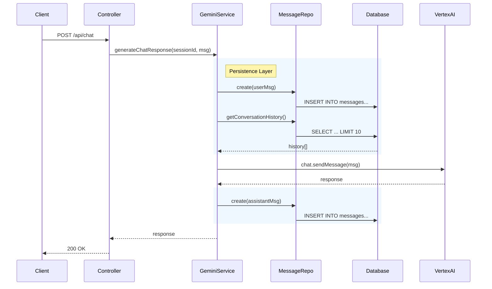

# ✅ Phase 2: Database Integration - COMPLETE

## 🎉 Summary

**Phase 2 is complete!** The application now has a robust persistence layer using PostgreSQL. The chat history is no longer in-memory but stored reliably in the database, enabling long-running conversations and future semantic search capabilities.

## 📦 What Was Delivered

### 1. **Database Schema**

- ✅ `src/database/migrations/001_initial_schema.sql`
  - `sessions` table: Tracks user sessions with expiry
  - `messages` table: Stores conversation history
  - `pgvector` enabled: Ready for semantic search (Phase 4 feature)
  - Indexes: Optimized for query performance

### 2. **Database Service**

- ✅ `src/services/dbService.ts`
  - Connection pooling for high concurrency
  - Transaction support (`db.transaction(...)`)
  - Health check integration
  - Automatic migration runner

### 3. **Data Access Layer (Repositories)**

- ✅ `src/repositories/sessionRepository.ts`
  - Session CRUD operations
  - Expiry management
- ✅ `src/repositories/messageRepository.ts`
  - Message persistence
  - History retrieval with limit
  - Token usage tracking

### 4. **Service Integration**

- ✅ **Updated `GeminiService`**
  - Fetches conversation context from DB
  - Persists User messages before API call
  - Persists AI responses after generation
  - Handles safety errors gracefully

- ✅ **Updated `ChatController`**
  - Uses `SessionRepository` for validation
  - Uses updated `GeminiService` for processing
  - Removed temporary in-memory storage

- ✅ **Updated Server & Health**
  - DB connection on startup
  - DB health check endpoint
  - Graceful shutdown for DB connections

---

## 🔄 Updated Architecture

---

## 🛠️ Verification & Next Steps

### How to Verify (Requires Docker)

Since the database requires a running PostgreSQL instance, the best way to verify is to verify in **Phase 3** when we set up `docker-compose`.

Top verifications needed:

1. **Schema Creation**: Does the migration run successfully?
2. **Session Creation**: Does `POST /api/sessions` create a DB row?
3. **Chat Flow**: Does `POST /api/chat` save both messages?
4. **History**: Does `GET /api/chat/:id` return the saved messages?

### 🚀 Proceeding to Phase 3: Containerization

In the next phase, we will:

1. Create `Dockerfile` for the application
2. Create `docker-compose.yml` including:
   - App service
   - PostgreSQL service (with pgvector)
3. Orchestrate the services to run locally
4. Prepare for Cloud Run deployment

**Ready to start Phase 3?**
