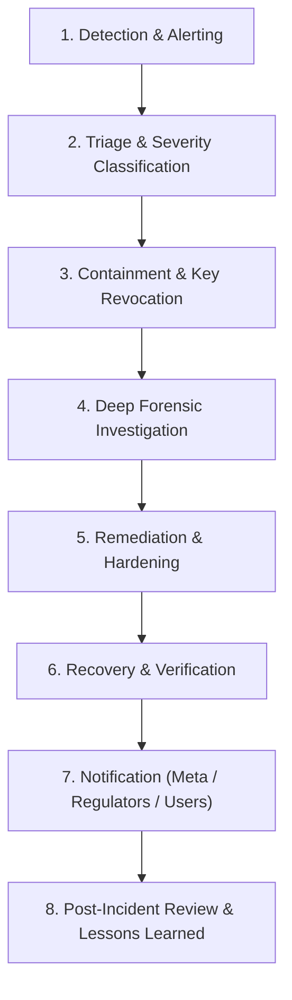

# RALION — Security Incident Response & Meta Breach Notification Policy

**Policy Reference:** SEC-POL-007  
**Entity:** Ras Ali Labs (Pty) Ltd  
**Standard:** Meta Platform Data Protection Assessment (Requirement: Documented Incident Response & Breach Escalation Procedure)  
**Effective Date:** August 2026  

---

## 1. Purpose

This policy outlines the formal procedures for detecting, triaging, containing, investigating, remediating, and reporting security incidents, data breaches, unauthorized access to Meta Platform Data, or token compromise within the Ralion ecosystem.

---

## 2. Incident Response Lifecycle

---

## 3. Incident Severity Levels & Meta Escalation SLA

| Severity | Definition | Examples | Meta Notification SLA |
| :--- | :--- | :--- | :--- |
| **SEV-1 (CRITICAL)** | Confirmed unauthorized exposure or exfiltration of Meta Platform Data or App Secret | Leaked Meta App Secret; compromised database with Meta User IDs | **Within 24 Hours** (Formal Notification to Meta) |
| **SEV-2 (HIGH)** | Potential unauthorized token access or brute-force pattern | Compromised admin account; anomalous token refresh spike | **Within 48 Hours** |
| **SEV-3 (MEDIUM)** | Isolated security control failure with no verified data exfiltration | Rate limit tripwire breach; failed credential stuffing | Internal Escalation within 7 days |
| **SEV-4 (LOW)** | Minor security alert or benign anomaly | Single unauthorized API probe blocked by WAF/RLS | Logged in Weekly Review |

---

## 4. Immediate Containment Runbooks

### 4.1 Compromised Meta Access Token
1. Execute `MetaCredentialService.revokeToken(userId, metaUserId)` to revoke Graph API access at Meta's endpoint immediately.
2. Invalidate local connection record in `meta_connections` by setting `connection_status = 'revoked'`.
3. Log `META_TOKEN_REVOKED` security audit event.

### 4.2 Leaked Meta App Secret / Service Role Key
1. Immediately regenerate Meta App Secret in the **Meta for Developers Console**.
2. Immediately rotate `SUPABASE_SERVICE_ROLE_KEY` in Supabase Project Settings.
3. Update server environment variables in Hostinger / Cloud hosting provider.
4. Restart all server application containers.
5. Invalidate all active user sessions and force re-authentication.

---

## 5. Meta Notification Protocol

For any confirmed SEV-1 or SEV-2 security incident involving Meta Platform Data, the Ralion Security Team must notify Meta:
* **Reporting Channel:** Via the Meta for Developers Support Portal and designated Meta security point of contact.
* **Report Contents:** Nature of incident, affected Meta User IDs (hashed), compromised data categories, containment actions taken, and remediation timeline.
