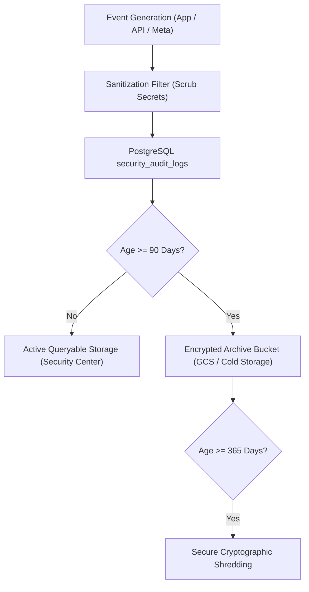

# RALION — Security Audit Log Retention & Archival Policy

**Policy Reference:** SEC-POL-004  
**Entity:** Ras Ali Labs (Pty) Ltd  
**Scope:** Ralion Ecosystem (Web, Admin, Supabase Cloud, APIs)  
**Standard:** Meta Platform Data Protection Assessment (Requirement: >= 30 Days Retention)  
**Effective Date:** August 2026  

---

## 1. Objective

This policy defines the retention, protection, integrity, and disposal requirements for all application, security, and administrative audit logs generated across the Ralion platform, with specific adherence to the **Meta Platform Data Protection Assessment** standards.

---

## 2. Mandatory Retention Standard

* **Meta Platform Requirement:** Audit logs must be retained for a minimum of **30 days**.
* **Ralion Standard:** Ralion enforces a baseline retention period of **90 days** (exceeding Meta's minimum by 300%) for active database logs, and **365 days** for cold archival storage.
* **Prohibition of Early Deletion:** Under no circumstances may security audit logs or admin event records be deleted or pruned prior to the expiration of the 90-day active retention period.

---

## 3. Log Types & Data Classification

| Log Stream | Source Table / Store | Retention Period | Description |
| :--- | :--- | :--- | :--- |
| **Meta Platform Events** | `security_audit_logs` | **90 Days** (Active) | Token creation, refresh, revocation, disconnects, API errors |
| **Authentication Logs** | `security_audit_logs` | **90 Days** (Active) | Logins, MFA challenges, failed attempts, password changes |
| **Admin Actions** | `security_audit_logs` | **180 Days** (Active) | Role modifications, user status changes, security reviews |
| **Threat & Alert Logs** | `security_alerts` | **365 Days** (Active) | Brute-force spikes, privilege escalation attempts, anomalies |
| **Weekly Review Records** | `security_review_records` | **730 Days** (2 Years) | Mandatory 7-day security audit reviews and sign-offs |

---

## 4. Immutability & Access Control (Zero Modification)

1. **Row Level Security (RLS) Immutability:**
   * PostgreSQL RLS policies on `security_audit_logs` prohibit all `UPDATE` and `DELETE` operations for standard database roles.
   * Only `INSERT` and restricted `SELECT` operations are authorized.
2. **Access Restrictions:**
   * Non-privileged users have **zero read access** to audit logs.
   * Only authenticated `PLATFORM_ADMIN` / `ORGANIZATION_OWNER` roles or authorized compliance officers may inspect audit logs via the Admin Security Center.
3. **Data Sanitization:**
   * Passwords, plain access tokens, refresh tokens, and private API secrets are scrubbed at the point of ingestion by `AuditLoggerService.sanitizeMetadata()` before persistence.

---

## 5. Automated Archival & Purge Schedule

---

## 6. Audit & Compliance Verification

The Ralion Compliance Officer must review retention adherence every **7 days** during the scheduled Weekly Security Review.
