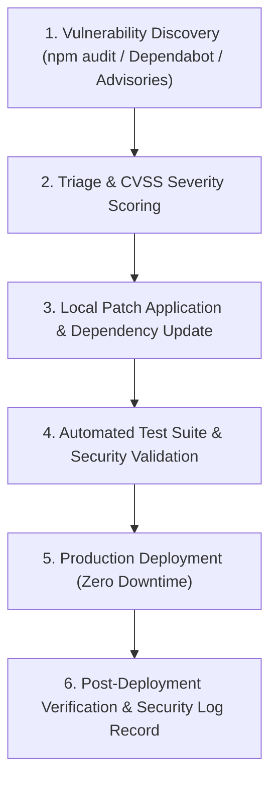

# Ralion Vulnerability, Patch and Update Management Policy

**Organization:** Ras Ali Labs (Pty) Ltd  
**System:** Ralion Platform and Backend Environment  
**Policy Owner:** Ras Ali Labs (Pty) Ltd — Security Architecture Team  
**Effective Date:** 15 August 2026 (`2026-08-15`)  
**Policy Classification:** Security Policy — Vulnerability and Patch Management  
**Compliance Standard:** Meta Data Protection Assessment (`updated-17.a.i` — Repeatable Security Patch & Update Management)  

---

## 1. Purpose

Ras Ali Labs (Pty) Ltd maintains a defined, structured, and repeatable process for identifying, evaluating, prioritizing, applying, and verifying software updates and security patches affecting the Ralion application and its supporting backend environment.

The purpose of this policy is to minimize the risk that known security vulnerabilities in third-party software, dependencies, operating runtimes, libraries, frameworks, container images, or supporting services could result in unauthorized access to Ralion systems or Meta Platform Data.

---

## 2. Scope

This policy applies to all software, runtime, and backend components used by Ralion, including:

* **Application Dependencies & Libraries:** Third-party Node.js/npm packages and UI libraries.
* **Frameworks & Core Runtimes:** Next.js, React, Node.js runtime, and TypeScript compiler tooling.
* **Security & Cryptographic Libraries:** Node.js native `crypto`, Supabase client SDKs (`@supabase/supabase-js`), and OAuth provider adapters.
* **Build & Deployment Tooling:** Monorepo package managers, GitHub Actions CI/CD workflows, and container packaging scripts.
* **Server-Side Software & Environment:** Server runtime configurations, API route handlers, and reverse-proxy configurations under Ras Ali Labs' direct control.

*Infrastructure Note:* Managed cloud platform services (such as Supabase managed PostgreSQL and cloud infrastructure) are maintained and patched at the infrastructure layer by the respective service provider under their SOC 2 Type II / ISO 27001 compliance programs, while Ras Ali Labs actively manages and patches the application client SDKs and database schema configurations.

---

## 3. Security Patch Identification (Repeatable Process)

> ### 🔍 MANDATORY REQUIREMENT: REPEATABLE PATCH IDENTIFICATION
> **Ras Ali Labs maintains a defined and repeatable process for identifying security patches in third-party software that address known security vulnerabilities.**

Security patches and dependency vulnerabilities are identified through systematic, multi-layered discovery channels:

1. **Automated CI/CD Dependency Auditing:**
   * Automated security scans executed on pull requests, pre-commit pipelines, and build workflows:
     ```bash
     npm run security:audit
     npm audit --omit=dev
     ```
2. **Repository Vulnerability Advisories:**
   * Automated dependency alerting enabled via GitHub Dependabot and security vulnerability databases (CVE/NVD).
3. **Vendor & Framework Advisories:**
   * Active monitoring of security releases from Next.js, Node.js, Supabase, and Meta Developer Platform changelogs.
4. **Static Code & Secret Scanning:**
   * Continuous code scans verifying zero hardcoded tokens, secrets, or vulnerable patterns in client-facing bundles.

---

## 4. Risk-Based Patch Prioritization

> ### ⚖️ MANDATORY REQUIREMENT: RISK-BASED PRIORITIZATION
> **Available security patches are prioritized based on security risk and severity, including CVSS severity where applicable.**

Security patches are evaluated and prioritized based on vulnerability severity, exploitability, and potential impact on Meta Platform Data:

| Severity Level | CVSS v3.1 Range | Remediation SLA | Operational Treatment |
| :--- | :---: | :---: | :--- |
| **CRITICAL** | **9.0 – 10.0** | **$\le$ 48 Hours** | Emergency hotfix pipeline; immediate developer alert; out-of-band production patch. |
| **HIGH** | **7.0 – 8.9** | **$\le$ 7 Days** | Prioritized sprint hotfix; scheduled deployment within 1 week. |
| **MEDIUM** | **4.0 – 6.9** | **$\le$ 30 Days** | Scheduled in next regular minor release cycle. |
| **LOW** | **0.1 – 3.9** | **$\le$ 90 Days** | Bundled with routine quarterly dependency maintenance. |

### Evaluation Criteria:
* **Exploitability & Exposure:** Remotely exploitable without authentication vs. requiring local access.
* **Data Impact:** Potential exposure, modification, or unauthorized access to Meta Platform Data or OAuth credentials.
* **Compensating Controls:** Existence of intermediate safeguards (e.g. Row Level Security, AES-256-GCM token encryption, rate limiting).

---

## 5. Ongoing Patch Application & Remediation

> ### 🔄 MANDATORY REQUIREMENT: ONGOING PATCH APPLICATION
> **Security patches are applied as an ongoing operational activity and are tracked through remediation and verification.**

Patch management is integrated into the daily and weekly engineering workflow and **never relies solely on an annual review**.



### The 7-Step Remediation Lifecycle:
1. **Identify:** Detect vulnerability via automated scanners or security advisories.
2. **Assess:** Evaluate CVSS score, exploitability, and system impact.
3. **Patch:** Upgrade package version in `package.json` and lockfile.
4. **Test:** Execute full automated test suites (`npm test`, `npm run test:e2e`, `npm run security:audit`).
5. **Deploy:** Deploy through automated CI/CD pipelines to production.
6. **Verify:** Perform post-deployment smoke test and security verification.
7. **Record:** Log the remediation action and update security tracking records.

---

## 6. Critical and High Severity Patches

> ### 🚨 MANDATORY REQUIREMENT: META PLATFORM DATA PROTECTION
> **High and Critical severity vulnerabilities that could result in unauthorized access to Meta Platform Data receive priority remediation.**

When a Critical or High severity vulnerability affects components handling Meta Platform Data:
* Remediation takes immediate precedence over routine feature development.
* If a patch cannot be immediately deployed without service disruption, temporary compensating controls (such as endpoint rate limiting, input sanitization, or temporary feature isolation) must be enabled within 24 hours while the permanent patch is prepared.
* Verification must confirm that token encryption (AES-256-GCM), credential vaults (`social_credentials`), and audit logging pipelines remain fully secure.

---

## 7. Dependency and Codebase Updates

* **Deterministic Builds:** Package versions are pinned using `package-lock.json` to prevent unintended sub-dependency drifting.
* **Regression Testing:** All dependency updates must pass unit tests, E2E chain tests, and build validation before merging into `main`.
* **Deprecated Package Monitoring:** Deprecated dependencies are flagged during routine audits and scheduled for replacement with actively maintained modern alternatives.

---

## 8. Backend Environment Updates

Ras Ali Labs maintains a clear demarcation between directly managed components and managed cloud infrastructure:

* **Directly Managed Software (Patched by Ras Ali Labs):** Next.js applications, server API routes, `@ralion/*` monorepo packages, cryptographic services, and database migration SQL scripts.
* **Managed Cloud Infrastructure (Patched by Supabase / Cloud Providers):** Physical server hardware, hypervisors, core PostgreSQL engine versions, and cloud IAM systems. Ras Ali Labs monitors provider security advisories and applies relevant client SDK updates.

---

## 9. Patch Testing and Verification

Before production release, all security patches are validated against the automated Ralion verification suite:

* **Cryptographic & Social Unit Tests:** `npm test` (`scripts/test-social.js` — AES-256-GCM encryption, OAuth CSRF nonces, webhook HMAC signatures).
* **Automated Security & Secret Audit:** `npm run security:audit` (`scripts/security-audit.js` — RLS policies, zero secret leaks, documentation completeness).
* **Production Readiness & E2E Chain:** `npm run test:e2e` (`scripts/production-e2e-readiness.js` — 12-stage full platform verification).
* **Type & Build Validation:** `npm run build` (TypeScript compilation, Next.js static exports).

---

## 10. Records and Evidence

Ras Ali Labs maintains records of security patching activities, including:
* Vulnerability and advisory identifiers (CVE / GitHub Advisory ID);
* Affected component and version delta;
* Assigned CVSS severity and triage decision;
* Git commit hashes and deployment timestamps;
* Verification test outputs retained in `docs/security/meta-compliance-evidence/`.

---

## 11. Continuous Update Requirement

Patch management is an active, continuous operational responsibility. Security advisories, package manager alerts, and vulnerability scanner reports are reviewed continuously, and security updates are deployed throughout the operational lifecycle of Ralion.

---

## 12. Mandatory Controls Summary

The following controls are mandatory across the Ralion ecosystem:

> ### 🔍 Mandatory Control 1: Defined Patch Identification Process
> **Ras Ali Labs maintains a defined and repeatable process for identifying security patches in third-party software that address known security vulnerabilities.**

> ### ⚖️ Mandatory Control 2: Risk-Based Prioritization
> **Available security patches are prioritized based on security risk and severity, including CVSS severity where applicable.**

> ### 🔄 Mandatory Control 3: Ongoing Patch Application
> **Security patches are applied as an ongoing operational activity and are tracked through remediation and verification.**

> ### 🚨 Mandatory Control 4: Priority Protection for Meta Platform Data
> **High and Critical severity vulnerabilities that could result in unauthorized access to Meta Platform Data receive priority remediation.**

---

## 13. Compliance Review

This policy is reviewed periodically and immediately upon any major architectural change, significant dependency upgrade, or material update to Meta Platform Data Protection standards.
