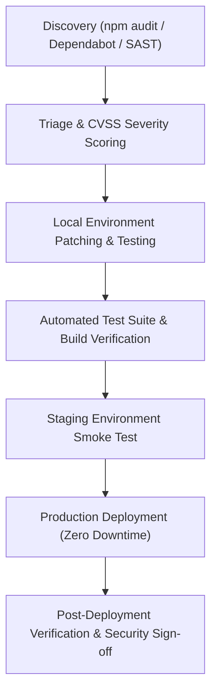

# RALION — Vulnerability Management & Patching Policy

**Policy Reference:** SEC-POL-005  
**Entity:** Ras Ali Labs (Pty) Ltd  
**Standard:** Meta Platform Data Protection Assessment (Requirement: Repeatable Patch Management Process)  
**Effective Date:** August 2026  

---

## 1. Purpose & Scope

This policy establishes a formal, repeatable procedure for identifying, evaluating, prioritizing, testing, and deploying security patches for third-party libraries, runtime dependencies, container images, and operating systems across the Ralion ecosystem.

---

## 2. Vulnerability Identification & Continuous Scanning

1. **Automated Dependency Auditing:**
   * Automated scan executed on every pull request and build pipeline via:
     ```bash
     npm run security:audit
     npm audit --omit=dev
     ```
2. **Secret & Key Scanning:**
   * Pre-commit and CI scans verify that no private API keys, Meta secrets, or service role credentials are committed.
3. **External Security Scans:**
   * Automated dependency alerting enabled via GitHub Dependabot / Snyk.

---

## 3. Vulnerability Severity & Remediation SLAs

Remediation timelines are strictly governed by the Common Vulnerability Scoring System (CVSS):

| Severity | CVSS v3 Score | Remediation SLA | Action & Escalation |
| :--- | :--- | :--- | :--- |
| **CRITICAL** | **9.0 – 10.0** | **Within 48 Hours** | Emergency hotfix pipeline; immediate developer alert |
| **HIGH** | **7.0 – 8.9** | **Within 7 Days** | Prioritized sprint hotfix; deployment within 1 week |
| **MEDIUM** | **4.0 – 6.9** | **Within 30 Days** | Scheduled in next regular minor release cycle |
| **LOW** | **0.1 – 3.9** | **Within 90 Days** | Bundled with routine dependency upgrades |

---

## 4. Patch Deployment & Verification Workflow


