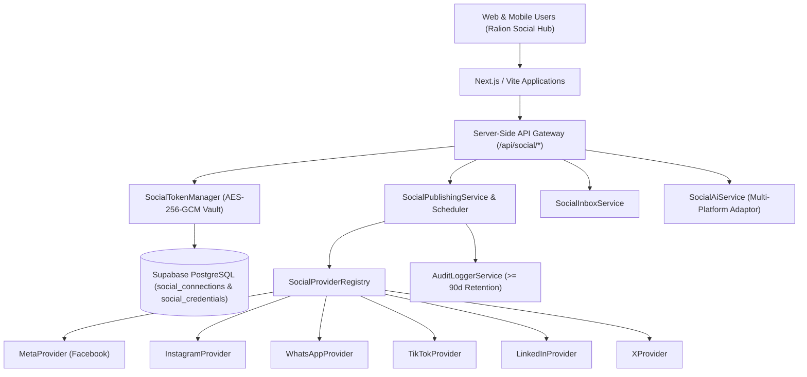

# RALION — Unified Social Media Architecture

**Architecture Reference:** ARCH-SOC-001  
**Entity:** Ras Ali Labs (Pty) Ltd  
**Product:** Ralion Enterprise OS / Growth OS / Social Hub  
**Date:** August 2026  

---

## 1. System Topology & Overview

Ralion Social Hub provides a centralized, multi-tenant platform for managing social media accounts, publishing multi-platform content, scheduling campaigns, processing unified inbox conversations, and tracking performance across:
1. **Facebook** (Meta Graph API: Pages & User Accounts)
2. **Instagram** (Meta Graph API: Professional / Business Accounts)
3. **WhatsApp** (Meta WhatsApp Business Platform / Cloud API)
4. **TikTok** (TikTok for Business & Content Posting API v2)
5. **LinkedIn** (LinkedIn Member & Organization/Page API)
6. **X (Twitter)** (X API v2 with OAuth 2.0 PKCE)

---

## 2. Key Design Principles

1. **Least-Privilege Isolation:**
   Client apps never receive raw access tokens or client secrets. Tokens are encrypted using **AES-256-GCM** and stored in the protected `social_credentials` table accessible only by the backend service role.
2. **Dynamic Capability Reflection:**
   Platform APIs possess distinct feature sets (e.g. WhatsApp is a messaging channel, not a public feed; TikTok requires video attachments). The UI dynamically adapts capabilities and displays clear messages if an action is unsupported.
3. **Multi-Platform Atomic Status Tracking:**
   When publishing across multiple networks simultaneously, the system evaluates each network independently, returning `PUBLISHED`, `PARTIALLY_PUBLISHED`, or `FAILED` with specific per-network error details.
4. **CSRF & Webhook Verification:**
   All OAuth flows use cryptographically random `state` nonces with 15-minute expiration. Inbound webhooks enforce HMAC-SHA256 signature verification.
