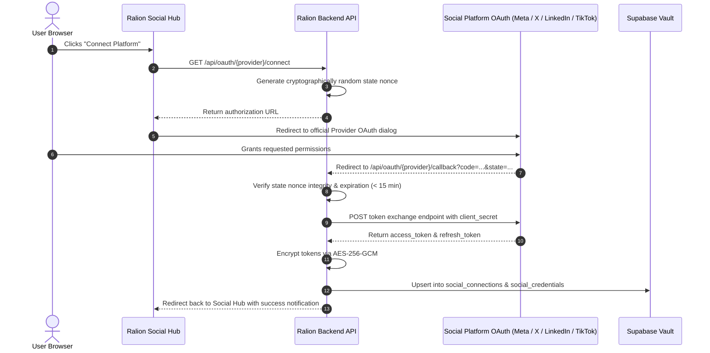

# RALION — Unified Social OAuth & Authentication Guide

**Reference:** OAUTH-SOC-001  
**Entity:** Ras Ali Labs (Pty) Ltd  
**Date:** August 2026  

---

## 1. Overview

Ralion enforces official OAuth 2.0 authorization code flows with PKCE and state-based CSRF protection across all connected social media networks.



---

## 2. CSRF State Protection

State tokens are generated using cryptographically random 16-byte nonces encoded with timestamp and workspace ID:
```typescript
export function generateOAuthState(workspaceId: string, provider: string): string {
  const nonce = crypto.randomBytes(16).toString('hex');
  const payload = JSON.stringify({ workspaceId, provider, nonce, ts: Date.now() });
  return Buffer.from(payload).toString('base64url');
}
```
State tokens expire after **15 minutes**.
