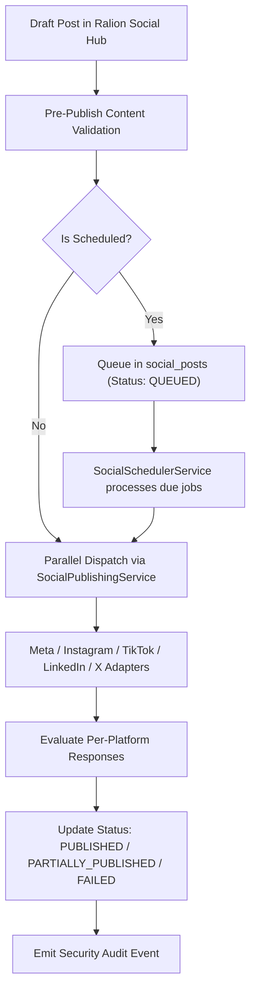

# RALION — Unified Social Publishing & Scheduler Engine

**Reference:** PUB-SOC-001  
**Entity:** Ras Ali Labs (Pty) Ltd  
**Date:** August 2026  

---

## 1. Multi-Platform Publishing Lifecycle

---

## 2. Content Constraints Matrix

| Platform | Max Text Length | Supported Media | Specific Constraints |
| :--- | :--- | :--- | :--- |
| **Facebook** | 63,206 chars | Images (JPG, PNG), Videos (MP4) | Requires Page Admin / Editor permissions |
| **Instagram** | 2,200 chars | Images (1:1, 4:5), Reels (9:16) | Media attachment is mandatory |
| **LinkedIn** | 3,000 chars | Images, Videos, Documents (PDF) | Supports member and organization page UGC posts |
| **X (Twitter)** | 280 chars | Images (up to 4), Video (up to 140s) | Strict character count limits |
| **TikTok** | 2,200 chars | Videos (MP4, MOV; 3s–10min) | Video attachment is mandatory |
| **WhatsApp** | 4,096 chars | Text, Images, PDFs, Voice Notes | 1-to-1 or broadcast template messaging |
